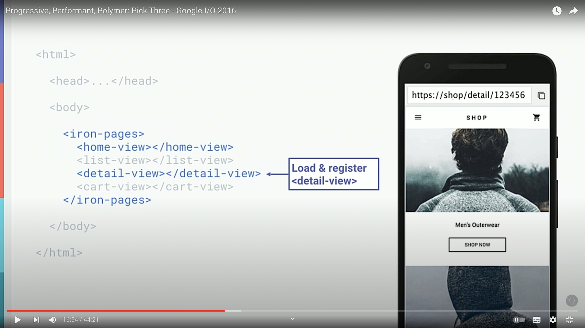
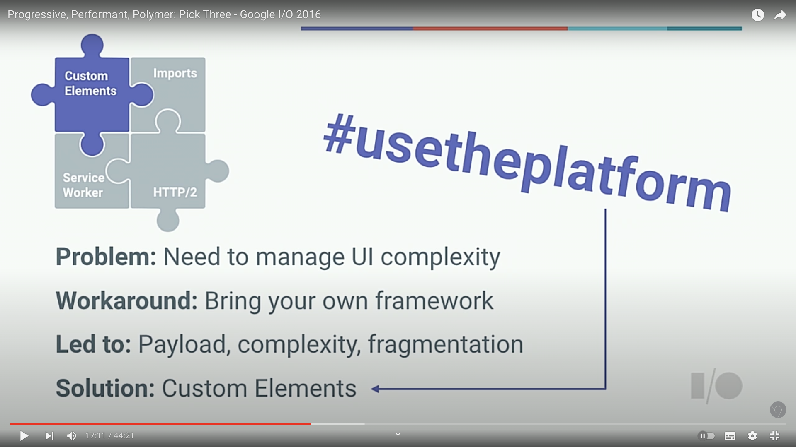
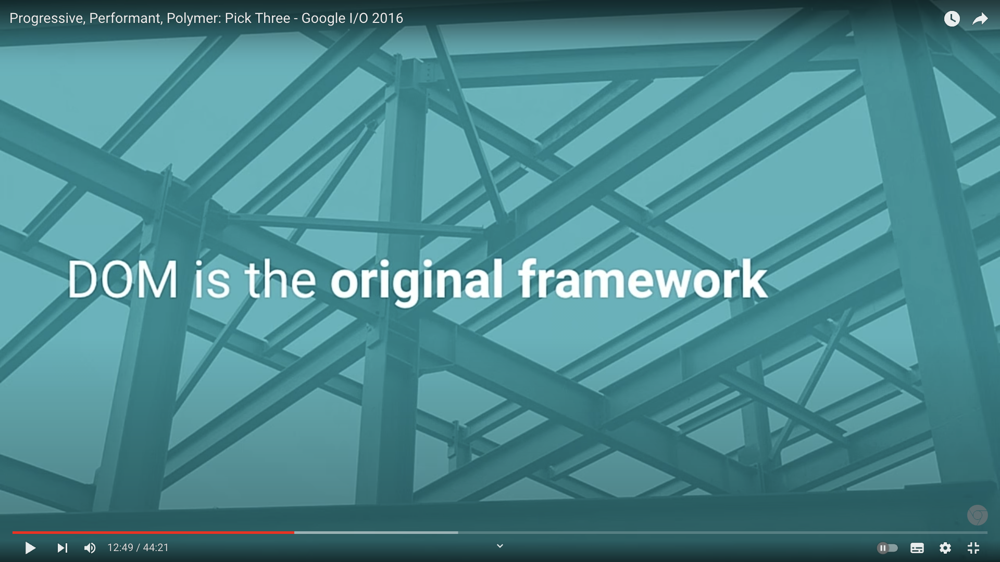
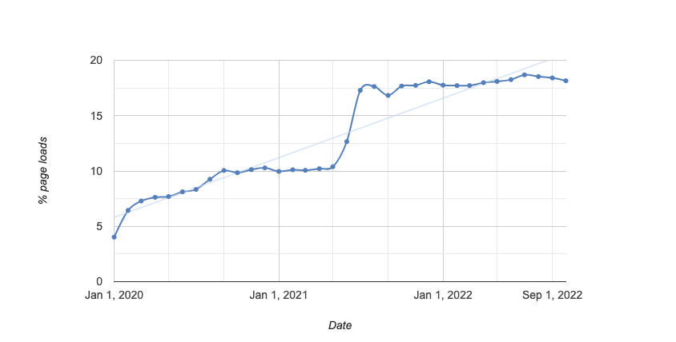
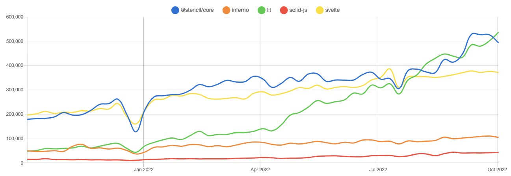
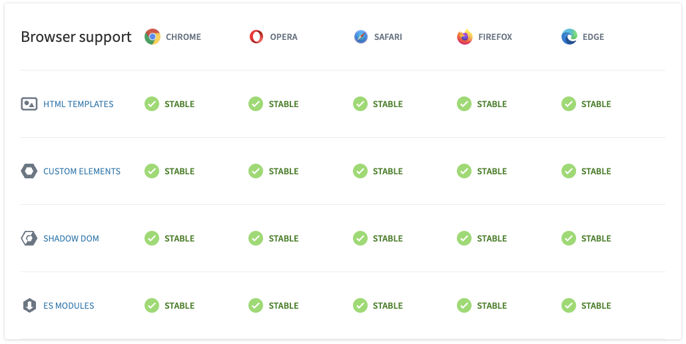

# Web Components


\- Edinburgh -

## ToC

- History of Web Development
- What are `Web Components`?
- How to create `Web Components`?
- Create `Web Components` with `Lit`
- Use `Web Components` w/others
- Conclusion

## History of Web Development

### 웹 개발 방식의 변화 (x의 진화)

기술의 발전과 요구사항 증가가 서로 맞물리면서 하나의 생태계를 이루고 점점 확장되어 가는 중

1. 서버가 만드는 동적 페이지 - asp, jsp, php, flash / MVC
2. 데이터의 분리 그리고 Frontend - Ajax, jQuery / M(Vx)
3. 모듈과 번들링 - node(npm), webpack, babel, rollup
4. `컴포넌트`(Declarative & Reactive), 프레임워크/라이브러리 춘추전국시대 - angular, react, vue, preact, svelte, solidjs / smaller MVx
5. 다시 데이터(상태)의 분리 - redux, recoil, jotai, zustand, react-query, swr / M(Vx)

그 외에도,  
Nextjs, Remix, JAM Stack, Micro Frontend...

### Frontend Evolution (1995-2019)


<출처: [https://github.com/ManzDev/frontend-evolution](https://github.com/ManzDev/frontend-evolution)>

### Native or Standard or Internalization

Vite

> Vite serves source code over native ESM.

Remix

> work back through web standards to deliver a fast, slick, and resilient user experience

Svelte

> Let's retire the 'virtual DOM is fast' myth once and for all

SolidJS

> With no Virtual DOM or extensive diffing the framework never does more work than you want it to.

Service Worker, PWA, WebAssembly, WebGL, WebSocket, WebRTC, WebContainers(?)

## What are `Web Components`?

### 컴포넌트 (Component)?

컴포넌트는 프로그램의 한 부분을 의미하며 재사용이 가능한 최소 단위 (= 모듈)

#### CBD (Component Based Development)

컴포넌트를 조합해 재사용함으로써 개발 생산성과 품질을 높이고 시스템 유지보수 비용을 최소화할 수 있는 개발방법론

### 웹 컴포넌트 (Web Components)?

컴포넌트(custom tag)를 생성하는 웹 표준 기술

> Web components are a set of web platform APIs that allow you to create new custom, reusable, encapsulated HTML tags to use in web pages and web apps.  
> \- webcomponents.org -



### 웹 컴포넌트 등장 배경

Keep calm and #UseThePlatform

- UI 복잡성을 관리를 위해
- 각자 다양한 프레임워크를 사용하지만
- 무겁고, 복잡하고, 파편화 됨

웹 컴포넌트를 사용하면

- 프레임워크는 더 가벼워지고
- 웹 표준 기반에서
- 벤더 락-인 없는 컴포넌트 작성

**_~~without~~ with Frameworks!_**




### 웹 컴포넌트 사용 현황


<"크롬에서 customElement.define을 호출하는 페이지 비율", 출처: [https://chromestatus.com/](https://chromestatus.com/metrics/feature/timeline/popularity/1689)>

### 프레임워크 비교

react(preact), vue를 제외하고 대체제로 떠오르는 프레임워크와 웹 컴포넌트를 위한 라이브러리(Lit, Stencil) 비교


<"최근 1년간 다운로드 수", 출처: [https://npmtrends.com](https://npmtrends.com/inferno-vs-lit-vs-solid-js-vs-svelte)>

## How to create `Web Components`?

### Specifications

#### Custom Elements

새로운 유형의 DOM 요소를 설계하고 사용하기 위한 기반을 제공 (새로 만든 엘리먼트 그 자체 또는 만드는데 사용하는 API - window.customElements)

#### Shadow DOM

웹 컴포넌트에서 캡슐화된 스타일과 마크업을 사용하는 방법을 정의 (페이지나 다른 컴포넌트의 HTML/CSS와 충돌하지 않도록 독립된 DOM 트리를 만들어줌)

#### ES Modules

#### HTML Template

엘리먼트의 구조(마크업)를 정의하기 위한 코드. 렌더링 되지 않으며 재사용 가능.

### 브라우저 지원 현황


<"Browser Support", 출처: [https://www.webcomponents.org/](https://www.webcomponents.org/)>

### HelloWorld (js)

```js
// JavaScript의 class를 사용하고 HTMLElement 상속
class HelloWorld extends HTMLElement {
  constructor() {
    super();
  }
  connectedCallback() {
    // DOM에 추가될 때 호출
    this.textContent = "Hello World!";
  }

  disconnectedCallback() {
    // DOM에서 제거될 때 호출
  }

  static get observedAttributes() {
    // 변경을 모니터링할 attribute이름의 배열
    return [];
  }

  attributeChangedCallback(name, oldValue, newValue) {
    // observedAttributes로 등록한 attribute들이 변경될 때 호출
  }

  adoptedCallback() {
    // document.adoptNode로 다른 document로 이동했을 때 호출 (거의 사용되지 않음)
  }
}
// 이름에 '-'가 반드시 포함되어야 함, 생성한 element를 CustomElementRegistry에 등록
customElements.define("hello-world", HelloWorld);
```

### Hello Wrold (html/css)

```html
<html>
  <head>
    <link rel="stylesheet" href="styles.css" />
    <!-- module 처럼 -->
    <script type="module" src="HelloWorld.js"></script>
  </head>
  <body>
    <hello-world />
  </body>
</html>
```

```css
/* element와 동일하게 스타일링 */
hello-world {
  font-weight: bold;
  color: red;
}
```

### More (in practice)

[https://stackblitz.com/edit/web-platform-nxw4wk](https://stackblitz.com/edit/web-platform-nxw4wk)

- [attribute 추가하기](https://stackblitz.com/edit/web-platform-nxw4wk?file=attributes.js,attributes.html,attributes.css)
- [shadow DOM](https://stackblitz.com/edit/web-platform-nxw4wk?file=shadowdom.js,shadowdom.html,shadowdom.css)
- [:host selector](https://stackblitz.com/edit/web-platform-nxw4wk?file=hostselector.js,hostselector.html,hostselector.css)
- [template](https://stackblitz.com/edit/web-platform-nxw4wk?file=template.js,template.html) / [slot](https://stackblitz.com/edit/web-platform-nxw4wk?file=slot.html,slot.js)
- [event](https://stackblitz.com/edit/web-platform-nxw4wk?file=event.html,event.js)

### Advanced

- [Declarative Shadow DOM](https://web.dev/declarative-shadow-dom/)
  SSR을 위해 Shadow DOM을 선언적으로 사용하는 것에 관한 내용
- [creating-custom-form-controls-with-elementinternals](https://css-tricks.com/creating-custom-form-controls-with-elementinternals/)
  form안에 custom으로 만든 input 요소가 있는 경우에 대한 처리
- [Custom Element Best Practices](https://web.dev/custom-elements-best-practices/)

## Create `web components` with `Lit`

### Lit

is a simple library for building fast, lightweight web components.

```ts
import { html, css, LitElement } from "lit";
import { customElement, property } from "lit/decorators.js";

@customElement("simple-greeting")
export class SimpleGreeting extends LitElement {
  static styles = css`
    p {
      color: blue;
    }
  `;

  @property()
  name = "Somebody";

  render() {
    return html`<p>Hello, ${this.name}!</p>`;
  }
}
```

### Defining

CustomElementRegistry에 등록

ts

```ts
@customElement("simple-greeting")
```

js

```js
customElements.define("simple-greeting", SimpleGreeting);
```

#### LitElement

HTMLElement < ReactiveElement(반응형 속성 관리) < LitElement(템플릿) 차례로 상속

### Rendering

`render`메서드 내에 `htm(tagged template literal)`을 사용해서 템플릿을 작성

```ts
  render() {
    return html`<p>Hello, ${this.name}!</p>`;
  }
```

#### composition

```ts
render() {
    return html`
        ${this.headerTemplate()} // another template
        ${this.articleTemplate()}`;
// 또는
    return html`
        <my-header></my-header> // another component
        <my-article></my-article>`;
}
```

### Reactive properties

`@property()` decorator 또는 `properties` 정적 필드 사용

#### ts

```ts
class MyElement extends LitElement {
  @property()
  name: string;
}
```

#### js

```js
class MyElement extends LitElement {
  static properties = {
    name: {},
  };
}
```

### Internal state

`@state()` decorator 또는 `{state: true}`를 추가

```ts
@state()
private _counter = 0;
```

```js
static properties = {
  _counter: {state: true};
};

constructor() {
  super();
  this._counter = 0;
}
```

### Styles

`css(tagged template literal)`을 사용해서 `styles` 정적 필드를 정의 (Shadow DOM)  
array 형식도 지원하고, superclass의 style도 상속 가능

```js
static styles = css`
    p {
      color: green;
    }
  `;
```

### Events

`@`를 사용해서 템플릿에 이벤트 리스너 추가

```js
return html`
  <p><button @click="${this._increment}">Click Me!</button></p>
  <p>Click count: ${this.count}</p>
`;
```

`@eventOptions` decorator를 사용해서 option 전달

```js
@eventOptions({passive: true})
private _handleTouchStart(e) { console.log(e.type) }
```

`connectedCallback`, `disconnectedCallback`를 사용해서 `window`나 `document`등에도 리스너 추가 가능

### in Practice

typescript  
[https://studio.webcomponents.dev/edit/X2HtcOtLRcGWh8Vx2zI6/src/index.ts?p=website](https://studio.webcomponents.dev/edit/X2HtcOtLRcGWh8Vx2zI6/src/index.ts?p=website)

javascript  
[https://studio.webcomponents.dev/edit/9FSyZGjtOQpGkLHjefEP/src/index.js?p=website](https://studio.webcomponents.dev/edit/9FSyZGjtOQpGkLHjefEP/src/index.js?p=website)

Interactive Tutorials  
[https://lit.dev/tutorials/](https://lit.dev/tutorials/)

React 개발자를 위한 Lit 안내  
[https://codelabs.developers.google.com/codelabs/lit-2-for-react-devs](https://codelabs.developers.google.com/codelabs/lit-2-for-react-devs#0)

## Use `Web Components` w/others

### React

[https://reactjs.org/docs/web-components.html](https://reactjs.org/docs/web-components.html)

> React and Web Components are built to solve different problems. Web Components provide strong encapsulation for reusable components, while React provides a declarative library that keeps the DOM in sync with your data. The two goals are complementary. As a developer, you are free to use React in your Web Components, or to use Web Components in React, or both.
> Most people who use React don’t use Web Components, but you may want to, especially if you are using third-party UI components that are written using Web Components.

### Vue

[https://vuejs.org/guide/extras/web-components.html](https://vuejs.org/guide/extras/web-components.html)

> We consider Vue and Web Components to be primarily complementary technologies. Vue has excellent support for both consuming and creating custom elements. Whether you are integrating custom elements into an existing Vue application, or using Vue to build and distribute custom elements, you are in good company.

### Others

[https://custom-elements-everywhere.com/](https://custom-elements-everywhere.com/)

대부분의 프레임워크나 라이브러리에서 별 문제 없이 웹 컴포넌트 사용 가능  
React는 아직 몇몇 문제가 있지만, @experimental release에서는 웹 컴포넌트의 모든 기능을 지원

[https://webcomponents.dev/blog/all-the-ways-to-make-a-web-component/](https://webcomponents.dev/blog/all-the-ways-to-make-a-web-component/)

웹 컴포넌트를 만드는 61가지 방법

## Conclusion

웹 컴포넌트는 처음 소개 된 뒤로 많은 발전이 되고 사용할 준비가 되었고, 무엇보다 코드의 수명을 늘리고 상호운용을 위해서는 웹 표준을 사용하는 것이 이상적임.

하지만 단독으로 사용하거나 직접 구현 하기에는 다른 프레임워크나 라이브러리들에 비해 부족한 기능(상태관리 등)들이 존재하고, DX 측면에서도 상대적으로 떨어지는 것도 사실.

이들의 장점들을 어느정도 모두 취하기 위해 편리하면서도 비교적 가벼운 프레임워크나 라이브러리를 통해 개발하고 웹 컴포넌트는 그 결과물(ex. 디자인 시스템, 컴포넌트 라이브러리 등)로서 배포하고 사용하는게 효율적인 방법.

## Reference

- [html.spec.whatwg.org](https://html.spec.whatwg.org/multipage/custom-elements.html)
- [webcomponents.org](https://www.webcomponents.org/)
- [Web Components (MDN)](https://developer.mozilla.org/ko/docs/Web/Web_Components)
- [web.dev/web-components](https://web.dev/web-components/)
- [Will Web Components Replace Frontend Frameworks?](https://medium.com/@mariusbongarts/will-web-components-replace-frontend-frameworks-535891d779ba)
- [A Complete Introduction to Web Components in 2022](https://kinsta.com/blog/web-components/)
- [Custom Elements Everywhere](https://custom-elements-everywhere.com/)
- [I/O 2016 Recap: #UseThePlatform](https://www.polymer-project.org/blog/2016-05-26-IO-2016-Recap)
- [All the Ways to Make a Web Component - Feb 2022 Update
  ](https://webcomponents.dev/blog/all-the-ways-to-make-a-web-component/)
- [Lit](https://lit.dev/)
